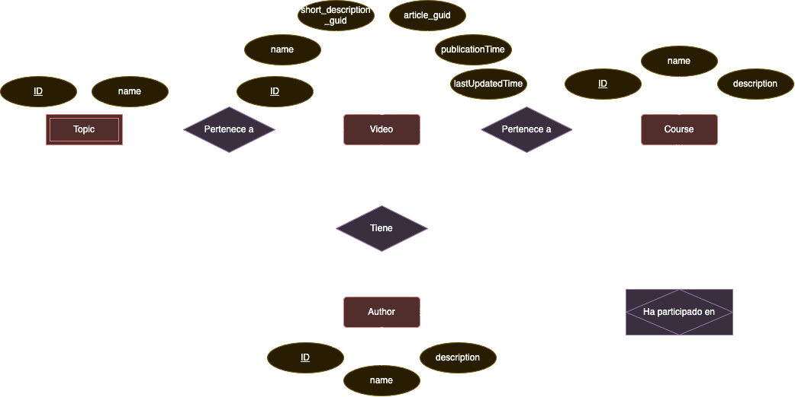
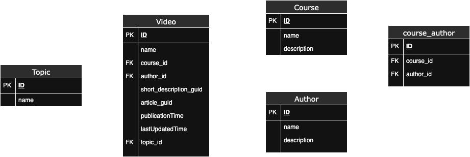

# Laboratorio Módulo 2A - Modelado Relacional

## Requisitos

### Descripción general

A continuación se resumen los requisitos de nuestro modelo según el enunciado. Se trata de un portal de programación con distintos cursos, conteniendo distintos videos dentro de cada curso.

* El portal va a estar compuesto por cursos, cada curso está compuesto a su vez por un número de videos y artículos que lo acompañan.
* Un vídeo pertenece a un único curso.
* Un vídeo está hecho por un único autor y se muestra en la página del vídeo.
* Un curso puede estar hecho por múltiples autores. Un autor puede haber participado en múltiples cursos.
* Los videos se pueden clasificar por temáticas (Devops / Front End / Back End / ...), para simplificar, un video va a pertenecer a una sóla temática.
* Hay una opción para ver la página con la biografía del autor.
* El archivo multimedia se almacena en un storage S3 y en un headless CMS → Solo almacenamos GUID o URL.
* Los detalles del vídeo también están almacenados en un recurso externo. Solo almacenamos un GUID.

### Requisitos parte obligatoria

* Generar el modelo de entidad - relación (físico).
* **Extra:** Generar el diagrama de Chen.

## Entidades

Las entidades que se han incluido para la parte obligatoria son las siguientes:

* Video: Contiene el ID, el nombre, el GUID de la descripción, el GUID del artículo, la fecha de publicación y la fecha de última actualización.
> Las fechas de publicación y de última actualización son relevantes para conocer qué vídeos son más recientes (o actualizados más recientemente) para luego poder mostrar los cursos más recientes en la página principal. Alternativamente o complementáriamente se podrían añadir los mismos atributos en la tabla de cursos.
* Course: Contiene el ID, el nombre y la descripción de un curso.
* Author: Contiene el ID, el nombre y la descripción bibliográfica de un autor.
* Topic: Contiene el ID y el nombre del tema al que pertenece un vídeo.
> Topic puede considerarse una entidad débil. Un tema no tiene sentido sin un vídeo que pertenezca a él.

## Relaciones

Se han establecido las siguientes relaciones entre las entidades. Algunas de ellas pueden ser interpretativas respecto a su obligatoriedad u opcionalidad.

* `Video - Topic (1:1)`: Un vídeo puede tener un único tema asociado. Un vídeo puede existir sin un tema asociado, pero un tema no puede existir sin un vídeo asociado → Topic es opcional, vídeo no.
* `Video - Course (1:M)`: Un vídeo puede pertenecer a un único curso, pero un curso tiene múltiples vídeos. Un vídeo puede existir sin estar asociado a un curso, y un curso puede existir sin vídeos (por ejemplo, que inicialmente se cree vacío) → ambos son opcionales en la relación.
* `Video - Author (1:M)`: Un vídeo está hecho por un único autor, pero un autor puede haber hecho múltiples vídeos. Un vídeo no puede existir sin autor, pero un autor sí puede existir sin vídeo → vídeo es opcional.
* `Author - Course (M:M)`: Un autor puede haber participado en múltiples cursos y múltiples autores pueden haber hecho un mismo curso. No deberían existir cursos sin un autor asociado, pero sí pueden existir autores que no hayan ningún curso (sujeto a interpretación y a la lógica de negocio) → curso es opcional.
> La relación Author - Course requiere de una tabla intermedia, que se marcará correspondientemente en el diagrama de Chen.

## Diagrama de Chen

En base a las [entidades](#entidades) y [relaciones](#relaciones) descritas anteriormente, el diagrama de Chen quedaría de la siguiente forma:

## Diagrama Entidad - Relación (físico)

En base a las [entidades](#entidades) y [relaciones](#relaciones) descritas anteriormente, el diagrama físico quedaría de la siguiente forma:

