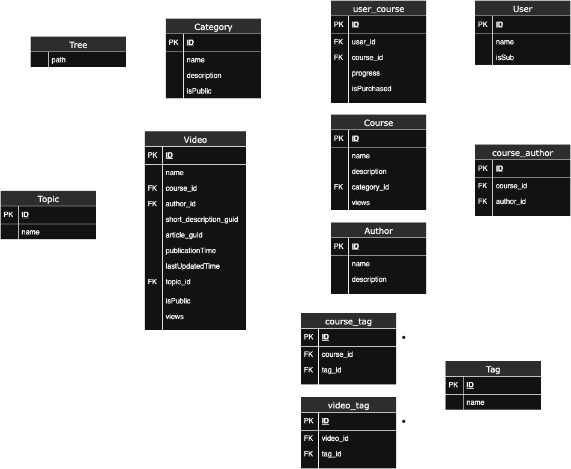

# Laboratorio Módulo 2A - Modelado Relacional + Opcional + Desafío

## Requisitos

### Descripción general

A continuación se resumen los requisitos de nuestro modelo según el enunciado. Se trata de un portal de programación con distintos cursos, conteniendo distintos videos dentro de cada curso.

* El portal va a estar compuesto por cursos, cada curso está compuesto a su vez por un número de videos y artículos que lo acompañan.
* Un vídeo pertenece a un único curso.
* Un vídeo está hecho por un único autor y se muestra en la página del vídeo.
* Un curso puede estar hecho por múltiples autores. Un autor puede haber participado en múltiples cursos.
* Los videos se pueden clasificar por temáticas (Devops / Front End / Back End / ...), para simplificar, un video va a pertenecer a una sóla temática.
* Hay una opción para ver la página con la biografía del autor.
* El archivo multimedia se almacena en un storage S3 y en un headless CMS → Solo almacenamos GUID o URL.
* Los detalles del vídeo también están almacenados en un recurso externo. Solo almacenamos un GUID.

### Requisitos parte obligatoria

* Generar el modelo de entidad - relación (físico).
* **Extra:** Generar el diagrama de Chen.

## Requisitos parte opcional + desafío
* Establecer un sistema de jerarquías más complejo (Ejemplo: Front End > React > Testing).
* Un curso puede ser público o privado.
* Un curso puede tener partes públicas y partes privadas.
* Podemos tener usuarios suscriptores y usuarios que compren cursos concretos.
* Podríamos añadir una nube de tags en cada curso o vídeo que permitiera hacer búsquedas rápidas.
* Conocer el progreso de un alumno en los cursos que está realizando.
* Visualizaciones de un vídeo.
* Visualizaciones de un curso como el sumatorio de las visualizaciones de todos sus cursos.

## Entidades

Las entidades que se han incluido para la parte obligatoria + opcional + desafío son las siguientes:

* Video: Contiene el ID, el nombre, el GUID de la descripción, el GUID del artículo, la fecha de publicación, la fecha de última actualización, si es público o no y el número de visualizaciones.
> Las fechas de publicación y de última actualización son relevantes para conocer qué vídeos son más recientes (o actualizados más recientemente) para luego poder mostrar los cursos más recientes en la página principal. Alternativamente o complementáriamente se podrían añadir los mismos atributos en la tabla de cursos.
* Course: Contiene el ID, el nombre, la descripción de un curso y el número de visualizaciones que puede ser auto-calculado.
* Author: Contiene el ID, el nombre y la descripción bibliográfica de un autor.
* Topic: Contiene el ID y el nombre del tema al que pertenece un vídeo.
* Category: Se refiere a una categoría dentro de la jerarquía. Una category corresponde con un curso cuando está en lo más alto de la jerarquía. Tiene su nombre, descripción y si es público o no.
* Tree: Una tabla con la jerarquía de las categorías (ver [jerarquías](#jerarquía)).
* Tag: Una etiqueta con su ID y su nombre.
* User: Contiene el nombre y si está suscrito.

## Jerarquía

Para crear un sistema de jerarquías como el solicitado en el enunciado (Ej: Front End > React > Testing) nos hemos valido de una nueva entidad llamada Category. Una category representa un eslabón en la jerarquía, por lo que pueden existir categories que correspondan con un curso (Ej: Front End) y otras que meramente son intermedias (Ej: React). El atributo isPublic de una category permite establecer visibilidades parciales o totales de los cursos, tal como indicaba el enunciado.

Seguidamente, para establecer las relaciones jerárquicas entre distintas categories se ha decidido crear una tabla Tree. Existen otras opciones como relaciones recursivas (como se hizo en la entrega de modelado documental) o Nested Sets, pero finalmente se ha decidido apostar por una filosofía de Materialized Paths. A continuación se adjunta un enlace a la documentación de PostgreSQL donde se habla de su implementación usando ltree:

https://www.postgresql.org/docs/current/ltree.html

## Relaciones

Se han establecido las siguientes relaciones entre las entidades. Algunas de ellas pueden ser interpretativas respecto a su obligatoriedad u opcionalidad.

* `Video - Topic (1:1)`: Un vídeo puede tener un único tema asociado. Un vídeo puede existir sin un tema asociado, pero un tema no puede existir sin un vídeo asociado → Topic es opcional, vídeo no.
* `Video - Course (1:M)`: Un vídeo puede pertenecer a un único curso, pero un curso tiene múltiples vídeos. Un vídeo puede existir sin estar asociado a un curso, y un curso puede existir sin vídeos (por ejemplo, que inicialmente se cree vacío) → ambos son opcionales en la relación.
* `Video - Author (1:M)`: Un vídeo está hecho por un único autor, pero un autor puede haber hecho múltiples vídeos. Un vídeo no puede existir sin autor, pero un autor sí puede existir sin vídeo → vídeo es opcional.
* `Author - Course (M:M)`: Un autor puede haber participado en múltiples cursos y múltiples autores pueden haber hecho un mismo curso. No deberían existir cursos sin un autor asociado, pero sí pueden existir autores que no hayan ningún curso (sujeto a interpretación y a la lógica de negocio) → curso es opcional.
* `Video - Tag (1:M)`: Un vídeo tiene un único tag, pero un mismo tag puede asociarse a múltiples vídeos. Aunque no se trata de una relación M:M, se ha construido una tabla de relaciones entre video y tag debido a que las tag también pueden ser relacionadas con courses. Un vídeo puede no tener una tag y una tag no tiene por qué tener un vídeo asociado ya que puede tener un curso en su lugar → ambos son opcionales.
* `Course - Tag (1:M)`: Un curso tiene un único tag, pero un mismo tag puede asociarse a múltiples cursos. Aunque no se trata de una relación M:M, se ha construido una tabla de relaciones entre course y tag debido a que las tag también pueden ser relacionadas con videos. Un curso puede no tener una tag y una tag no tiene por qué tener un curso asociado ya que puede tener un video en su lugar → ambos son opcionales.
* `User - Course (M:M)`: Un usuario puede comprar múltiples cursos (significa que los ha comprado individualmente en lugar de pagar la suscripción isSub), así como un curso puede haber sido comprado por múltiples usuarios. La tabla de relación entre Usuario y Curso también se aprovechará para guardar si un Usuario ha comprado un Curso (isPurchased) y cuál es el progreso de un usuario en un curso. Por tanto, aunque un usuario no tiene por qué comprar ningún curso ni un curso tiene por qué tener usuarios que han pagado por él (puede ser 100% gratuito), el hecho de que queramos almacenar esta información adicional hace que esta relación sea obligatoria en ambas direcciones (también se pueden explorar otras opciones como crear una tabla a parte).
* `Course - Category (1:1)`: Un curso siempre tiene asociada una category que le representa en el árbol de jerarquías, pero no todas las category son cursos → curso es opcional.
* `Category - Tree (1:M)`: Los path de Tree son los nombres de las Category separados por un caracter como un punto. Es una relación 1:M obligatoria que también exige nombres **únicos** para cada category. Véase [jerarquía](#jerarquía).

## Diagrama Entidad - Relación (físico)

En base a las [entidades](#entidades) y [relaciones](#relaciones) descritas anteriormente, el diagrama físico quedaría de la siguiente forma:

