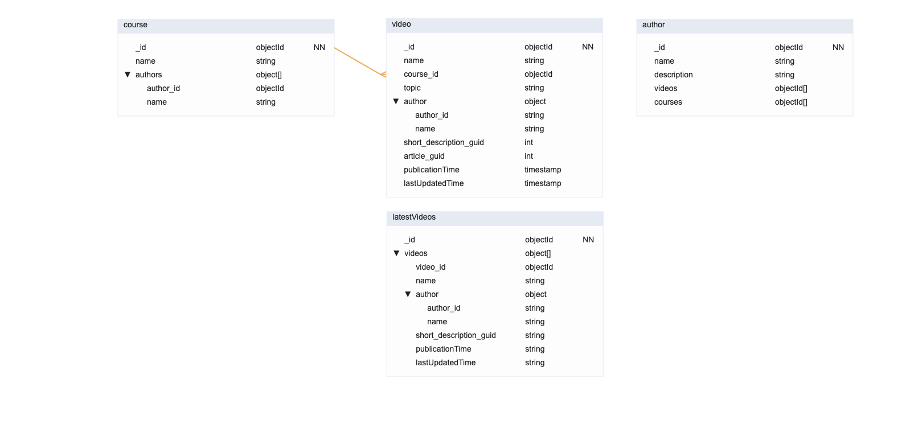

# Laboratorio Módulo 1 - Modelado

## Requisitos

### Descripción general

A continuación se resumen los requisitos de nuestro modelo según el enunciado. Se trata de un portal de programación con distintos cursos conteniendo distintos videos dentro de cada curso.

* Un vídeo pertenece a un único curso.
* Un vídeo está hecho por un único autor y se muestra en la página del vídeo.
* Un curso puede estar hecho por múltiples autores. Un autor puede haber participado en múltiples cursos.
* Se puede ver una página con datos del autor → Poco visitada.
* Se puede ver el detalle de un curso y los vídeos asociados a dicho curso → Visitada a menudo.
* Se puede ver una página propia para cada vídeo con su descripción y detalles → Visitada a menudo.
* El archivo multimedia se almacena en un storage S3 y en un headless CMS → Solo almacenamos GUID o URL.
* Los detalles del vídeo también están almacenados en un recurso externo. Mongo solo almacenará un GUID.
* Escritura: Se espera que no se suba más de un par de cursos al día y no se cree más de un autor al día.

### Requisitos parte obligatoria

* Queremos mostrar los últimos cursos publicados.
* Queremos mostrar cursos por área (devops, front end, ...).
* Queremos mostrar un curso con sus vídeos.
* En un vídeo queremos mostrar su autor.

## Solución propuesta

Para el modelado de los datos, se ha partido de una estructura con tres colecciones: category, video y author.

* **Category:** Se refiere a una categoría o grupo a la que un vídeo puede pertenecer. En el caso concreto de la parte obligatoria de esta entrega, esta colección se refiere a un curso. Sin embargo, en la parte opcional se tratará al curso como un caso particular de category. Contiene el nombre del curso y la información de sus autores.

* **Video:** Contiene la información relativa a un video: nombre, categoría (curso) al que pertenece, autor, descripción corta (para la página principal), artículo (texto descriptivo en la página principal del vídeo), fecha de publicación y fecha de su última actualización.

    * Recordemos que la descripción corta y el artículo se almacenan en un recurso externo pero se ha especificado que mongo guarda su GUID.

    * Las fechas de publicación y fecha de última actualización son datos relevantes para saber cuáles son los últimos cursos publicados (o que se actualizaron más recientemente).

* **Author:** Contiene la información de los autores de los cursos y/o videos, con su nombre, descripción, array de sus cursos y array de sus videos. Se podrían añadir más campos como fecha de nacimiento o redes sociales.

A estas tres colecciones se le añade una cuarta:

* **LatestVideos:** Se trata de una colección autocalculada con los últimos vídeos publicados, que se mostrarán en la página principal correspondiente. De este modo, cuando se acceda a la página principal se puede acceder a esta lista reducida de vídeos (y con menos campos en cada uno de ellos), separada de la colección principal de vídeos.

## Patrones aplicados

### Extended reference pattern

En este modelo, los cursos y videos consumen datos de los autores. No obstante, mientras que estas páginas se espera que sean muy visitadas, la página principal de los autores se espera que tenga muchas menos visitas. Esto implica que cargar la colección completa de los autores para usarse en los vídeos y cursos es ineficiente.

Aplicando el patrón de extended reference pattern, podemos embeber los datos de los autores directamente sobre las colecciones de vídeos y cursos. De esta forma, solo se consume la información de los autores necesaria, tanto por el número de autores como por el número de campos de cada autor a cargar.

El precio a pagar es que se están duplicando los datos, y por tanto en un caso de escritura hay que modificar todas las referencias al mismo autor en distintas colecciones. Sin embargo, sabemos por el enunciado que no se espera que se cree más de un autor al día, y por extensión (y sentido común) tampoco se espera una gran frecuencia del resto de operacines CRUD sobre los autores.

### Subset pattern / Computed pattern

Dado que se va a consumir con mucha frecuencia un listado de los últimos vídeos publicados, en el modelo se ha tomado la decisión de crear una colección distinta a la de "video" llamada "latestVideos". De esta forma, la página principal puede consumir directamente un subconjunto (subset) de vídeos que el backend le sirve por separado. De esta forma, no será necesario realizar repetidamente una consulta a la colección de vídeos filtrando por las fechas de publicación más recientes, sino que se puede precalcular ese subconjunto tras producirse una escritura de un nuevo vídeo (se sabe por el enunciado que no se espera publicar más de un par de vídeos al día).

Esta decisión de diseño presenta características mixtas del Subset pattern y el Computed pattern vistos en la teoría. Por un lado, se usa la filosofía del Subset pattern en tanto en cuanto se está tomando un subset de vídeos para evitar cargar todo el conjunto (y con todos los campos), aunque en este caso se está poniendo el subset en una colección nueva en lugar de embeberla como campo en una ya existente como pasaba con las reseñas. Por otro lado, esta implementación también usa la filosofía del Computer pattern para evitar un cálculo repetitivo de seleccionar los vídeos filtrando por su fecha de publicación o de actualización (aunque en este caso no se trate de un cómputo matemático como en los ejemplos de la teoría). De esta forma, es posible dejar esto precalculado tras cada escritura dado que no se espera publicar más de un par de videos al día.

> En la solución propuesta, latestVideos solo ha eliminado el GUID hacia el artículo comparado con la colección de videos, pero si la página principal no precisa de datos como el autor también se podrían suprimir esos campos para mayor optimización.

Tal como pasa con el patrón de Extended reference, el precio a pagar en este planteamiento es el duplicado de datos. Esto hace que en caso de operaciones CRUD se deba de modificar documentos en distintas colecciones.

### Tree pattern

En la parte obligatoria de esta entrega las referencias entre padres e hijos son mínimas, ya que con solo dos niveles de jerarquía ( Curso > Video ) no se requiere de mayor referencia que establecer una relación 1:M entre category y video.

Sin embargo, como veremos en la parte opcional de la entrega, en esta parte obligatoria hemos preparado los cimientos para establecer un Tree pattern de cara a la parte opcional.