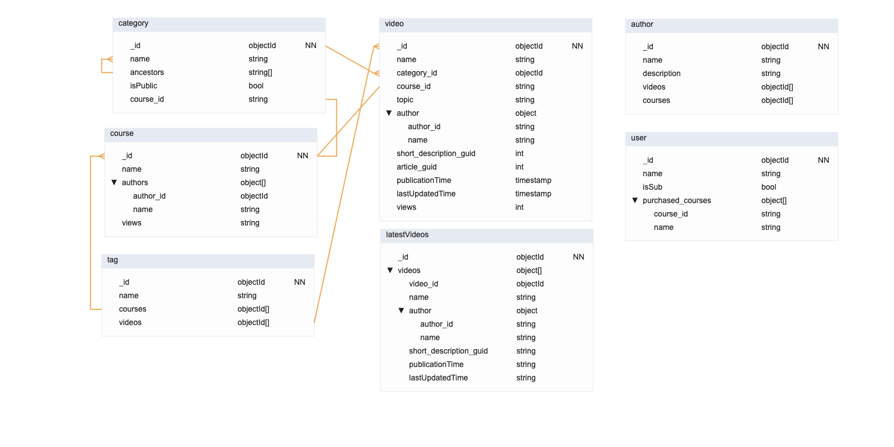

# Laboratorio Módulo 1 - Modelado (Obligatoria + Opcional + Desafío)

## Requisitos

### Descripción general

A continuación se resumen los requisitos de nuestro modelo según el enunciado. Se trata de un portal de programación con distintos cursos conteniendo distintos videos dentro de cada curso.

* Un vídeo pertenece a un único curso.
* Un vídeo está hecho por un único autor y se muestra en la página del vídeo.
* Un curso puede estar hecho por múltiples autores. Un autor puede haber participado en múltiples cursos.
* Se puede ver una página con datos del autor → Poco visitada.
* Se puede ver el detalle de un curso y los vídeos asociados a dicho curso → Visitada a menudo.
* Se puede ver una página propia para cada vídeo con su descripción y detalles → Visitada a menudo.
* El archivo multimedia se almacena en un storage S3 y en un headless CMS → Solo almacenamos GUID o URL.
* Los detalles del vídeo también están almacenados en un recurso externo. Mongo solo almacenará un GUID.
* Escritura: Se espera que no se suba más de un par de cursos al día y no se cree más de un autor al día.

### Requisitos parte obligatoria

* Queremos mostrar los últimos cursos publicados.
* Queremos mostrar cursos por área (devops, front end, ...).
* Queremos mostrar un curso con sus vídeos.
* En un vídeo queremos mostrar su autor.

### Requisitos parte opcional y desafío

* Implementar una estructura jerárquica más compleja (ejemplo: Front End > React > Testing).
* Los vídeos y los cursos pueden ser públicos y privados.
* Un curso puede ser parcialmente público y el resto privado.
* Existen usuarios y suscripciones, o bien usuarios que realizan un pago único para acceder a un curso concreto.
* Implementar una nube de tags en cada curso o vídeo para hacer busquedas rápidas.
* Se quiere mostrar el número de visualizaciones de un vídeo y el total de visualizaciones de los vídeos que pertenecen a un curso. No se requiere un cálculo a tiempo real.

## Resolución

Se parte de la implementación hecha durante en la parte opcional, que consta de las colecciones: category, video, author y latest_videos.

* **Category:** Se refiere a una categoría o grupo a la que un vídeo puede pertenecer. Un curso es un caso particular de category, pero no todos los cursos son category. Un curso es un tipo de category que no tiene padres y que además contiene información específica como un autor o el número de visualizaciones.

* **Video:** Contiene la información relativa a un video: nombre, categoría al que pertenece, curso al que pertenece, autor, descripción corta (para la página principal), artículo (texto descriptivo en la página principal del vídeo), número de visitas, fecha de publicación y fecha de su última actualización.

* **Author:** Contiene la información de los autores de los cursos y/o videos, con su nombre, descripción, array de sus cursos y array de sus videos. Se podrían añadir más campos como fecha de nacimiento o redes sociales.

* **LatestVideos:** Se trata de una colección autocalculada con los últimos vídeos publicados, que se mostrarán en la página principal correspondiente. De este modo, cuando se acceda a la página principal se puede acceder a esta lista reducida de vídeos (y con menos campos en cada uno de ellos), separada de la colección principal de vídeos.

### La jerarquía de Vídeos, Categorías y Cursos

Antes de continuar, cabe aclarar con mayor detalle cómo se ha resuelto la jerarquía en este planteamiento. Anteriormente, sólo existían dos niveles: Curso > Vídeo. Esto se podía resolver fácilmente con una simple relación de muchos a uno (1:M).

Ahora, sin embargo, podría existir un número indeterminado de eslabones intermedios entre el curso y el vídeo. Para resolver esto, des del inicio se creó una colección llamada category del que, en realidad, un curso es simplemente un caso particular (es decir, un curso es un tipo de category). Un vídeo puede pertenecer a una category mediante un campo category_id y una relación de muchos a uno (1:M, múltiples vídeos pueden pertenecer a una misma categoría). Estas categorías, al mismo tiempo, pueden estar anidadas, apuntando cada una de ellas a sus ancestros mediante el campo *ancestors* (String[]).

Una categoría corresponde a un curso cuando no tiene ancestros (es decir, está en lo más alto de la jerarquía) y, además, tiene un course_id asociado. De este modo, mediante una relación 1:1 podemos referenciar una categoría que coincide con un curso a un documento de la colección *course*, que contiene campos de información adicionales como los autores del curso o el número de visitas.

### Solución propuesta

Con la finalidad de cumplir todos los requerimentos de la parte opcional y del desafío, se ha partido de la base anteriormente discutida y se han añadido también las colecciones de user y tag, así como campos adicionales y las relaciones pertinentes.

El sistema de etiquetas se ha implementado mediante una nueva colección llamada **tag**. Contiene su id, nombre y unos arrays de cursos y vídeos que pertenecen a esta tag.

También se ha añadido la colección **user**. Se trata de una colección que almacena información sobre los usuarios: su nombre, isSub (si está suscrito) y unos listados de cursos cuya presencia en la lista indicaría que han sido comprados por el usuario.

El campo isSub (Booleano) del usuario y su listado de cursos son relevantes para gestionar la visibilidad de los vídeos y cursos. Además de esto, también se ha añadido un campo isPublic (Booleano) en las colecciones de category y video. De esta forma, se puede controlar la visibilidad tanto a nivel de vídeos individuales como en cualquier eslabón de la jerarquía, permitiendo bloqueos de contenido parciales o totales. A partir de aquí, corresponde a la lógica de negocio conceder o retirar el acceso a dichos recursos en base a la información establecida en nuestro modelo de base de datos.

Por último, también se ha añadido el número de visitas como campo en las colecciones de videos y cursos. Estos datos se estimarán siguiendo el planteamiento del Approximation pattern. De esta forma, evitaremos hacer una escritura en la base de datos cada vez que se realice una visualización del contenido, sino que se esperará a tener varias visualizaciones (o que pase un cierto tiempo) para realizar la escritura de dichas visualizaciones acumuladas.

## Patrones aplicados

### Extended reference pattern

En este modelo, los cursos y videos consumen datos de los autores. No obstante, mientras que estas páginas se espera que sean muy visitadas, la página principal de los autores se espera que tenga muchas menos visitas. Esto implica que cargar la colección completa de los autores para usarse en los vídeos y cursos es ineficiente.

Aplicando el patrón de extended reference pattern, podemos embeber los datos de los autores directamente sobre las colecciones de vídeos y cursos. De esta forma, solo se consume la información de los autores necesaria, tanto por el número de autores como por el número de campos de cada autor a cargar.

El precio a pagar es que se están duplicando los datos, y por tanto en un caso de escritura hay que modificar todas las referencias al mismo autor en distintas colecciones. Sin embargo, sabemos por el enunciado que no se espera que se cree más de un autor al día, y por extensión (y sentido común) tampoco se espera una gran frecuencia del resto de operacines CRUD sobre los autores.

### Subset pattern / Computed pattern

Dado que se va a consumir con mucha frecuencia un listado de los últimos vídeos publicados, en el modelo se ha tomado la decisión de crear una colección distinta a la de "video" llamada "latestVideos". De esta forma, la página principal puede consumir directamente un subconjunto (subset) de vídeos que el backend le sirve por separado. De esta forma, no será necesario realizar repetidamente una consulta a la colección de vídeos filtrando por las fechas de publicación más recientes, sino que se puede precalcular ese subconjunto tras producirse una escritura de un nuevo vídeo (se sabe por el enunciado que no se espera publicar más de un par de vídeos al día).

Esta decisión de diseño presenta características mixtas del Subset pattern y el Computed pattern vistos en la teoría. Por un lado, se usa la filosofía del Subset pattern en tanto en cuanto se está tomando un subset de vídeos para evitar cargar todo el conjunto (y con todos los campos), aunque en este caso se está poniendo el subset en una colección nueva en lugar de embeberla como campo en una ya existente como pasaba con las reseñas. Por otro lado, esta implementación también usa la filosofía del Computer pattern para evitar un cálculo repetitivo de seleccionar los vídeos filtrando por su fecha de publicación o de actualización (aunque en este caso no se trate de un cómputo matemático como en los ejemplos de la teoría). De esta forma, es posible dejar esto precalculado tras cada escritura dado que no se espera publicar más de un par de videos al día.

> En la solución propuesta, latestVideos solo ha eliminado el GUID hacia el artículo comparado con la colección de videos, pero si la página principal no precisa de datos como el autor también se podrían suprimir esos campos para mayor optimización.

Tal como pasa con el patrón de Extended reference, el precio a pagar en este planteamiento es el duplicado de datos. Esto hace que en caso de operaciones CRUD se deba de modificar documentos en distintas colecciones.

### Tree pattern

En este modelo hemos aplicado dos tipos distintos de Tree pattern con la finalidad de establecer las relaciones jerárquicas de la forma más eficiente posible (véase el apartado *[La jerarquía de Vídeos, Categorías y Cursos](#la-jerarquía-de-vídeos-categorías-y-cursos)*).

Para empezar, queremos que des de un vídeo o cualquier categoría intermedia sea posible conocer todos sus ancestros hasta el curso que lo contiene todo. Esto no puede ser una consulta pesada, ya que las páginas específicas de una categoría o de un vídeo mostrarán un árbol de contenido (Ejemplo: Front > React > Testing). Con este objetivo, se ha añadido a la colección category el campo *ancestors* (String[]), haciendo que la consulta de la información sea immediata porque nos devuelve una lista de todos los ancestros. No obstante, habría que tener precaución si se crean categorías o cursos con nombres idénticos, por lo que se recomendaría que el campo nombre de una categoría fuese un campo único.

Si bien en el caso anterior se ha establecido una referencia des de un documento hijo hacia todos sus padres, también por otro lado se ha usado un tree pattern des del padre hacia los hijos. Esto se ha usado en tag, una colección donde almacenamos arrays de todos sus hijos (tanto cursos como videos). Esto hace la búsqueda mediante tags muy rápida, ya que permite obtener todo el contenido asociado a un mismo tag de forma immediata.

### Approximation pattern

Tal como se vió en la teoría, para obtener el recuento de visitas de un vídeo y el de todos los vídeos de un mismo curso, es preferible no realizar una escritura cada vez que se produzca una visualización. En el caso de que existan muchas visualizaciones, esto podría comportar una carga de escrituras innecesariamente grande para un campo que tampoco requiere ese nivel de detalle y precisión. Por tanto, usando la filosofía del approximation pattern, se agruparán las visualizaciones y se realizará una escritura conjunta para reducir la carga de escrituras en la base de datos.